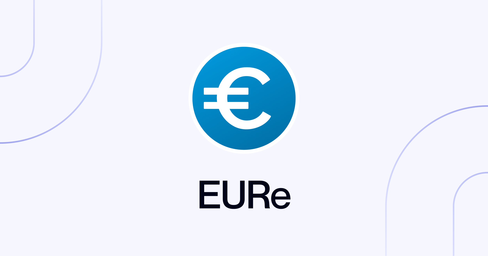

<h1 style="text-align: center">Monerium's EURe on Noble</h1>

This repository includes the `x/florin` Cosmos SDK module implementation.

For more information, refer to the module's [spec](../x/florin/spec) files.
